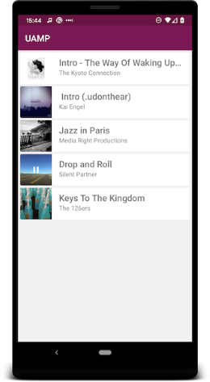
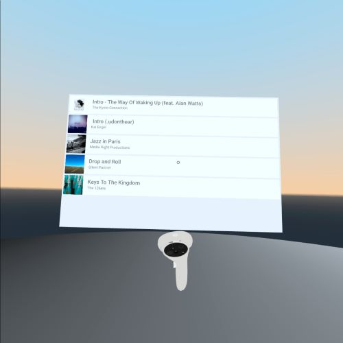
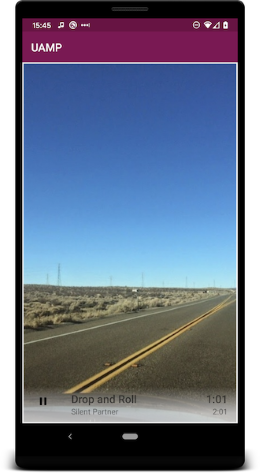
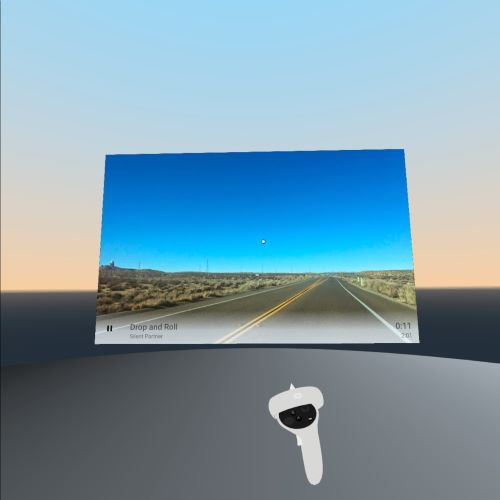

XR Universal Android Music Player Sample
========================================
The sample shows how to implement a XR audio media app that works and provides a 
consistent user experience on XR devices like the [Meta Quest](https://en.wikipedia.org/wiki/Oculus_Quest) 
and on regular Android devices by using the [Godot XRApp framework](https://github.com/m4gr3d/GAST/tree/master/core/src/xrapp). 

To find out how to integrate the [Godot XRApp framework](https://github.com/m4gr3d/GAST/tree/master/core/src/xrapp)
in an Android app, please check the [Usage section](https://github.com/m4gr3d/GAST/tree/master/core/src/xrapp#usage).

This sample is based off the [UAMP](https://github.com/android/uamp) sample.

Pre-requisites
--------------

- Android Studio 3.x

Getting Started
---------------

This sample uses [Android product flavors](https://developer.android.com/studio/build/build-variants#product-flavors) 
to customize whether a XR build or a regular build is generated.

You can find the product flavors configuration [here](https://github.com/m4gr3d/xruamp/blob/f8ff03978170ab72b3d76e767e35a540047032bd/app/build.gradle#L47)
and [here](https://github.com/m4gr3d/xruamp/blob/f8ff03978170ab72b3d76e767e35a540047032bd/common/build.gradle#L36).
And the XR toggle is in the [MainActivity](https://github.com/m4gr3d/xruamp/blob/f8ff03978170ab72b3d76e767e35a540047032bd/app/src/main/java/com/example/android/uamp/MainActivity.kt#L37).

To generate a build, use the following commands:
- XR build:
    - `gradlew assembleImmersiveDebug`
    - The generated apk can be found under `app\build\outputs\apk\immersive\debug`
- Regular build:
    - `gradlew assemblePancakeDebug`
    - The generated apk can be found under `app\build\outputs\apk\pancake\debug`

Support
-------

If you've found an error in this sample, please
[file an issue](https://github.com/m4gr3d/xruamp/issues)

Patches are encouraged and may be submitted by forking this project and
submitting a pull request through GitHub.

Music
-----

Music provided by the [Free Music Archive](http://freemusicarchive.org/).

- [Irsen's Tale](http://freemusicarchive.org/music/Kai_Engel/Irsens_Tale/) by
[Kai Engel](http://freemusicarchive.org/music/Kai_Engel/).
- [Wake Up](http://freemusicarchive.org/music/The_Kyoto_Connection/Wake_Up_1957/) by
[The Kyoto Connection](http://freemusicarchive.org/music/The_Kyoto_Connection/).

License
-------

Copyright 2017 Google Inc.

Licensed to the Apache Software Foundation (ASF) under one or more contributor
license agreements.  See the NOTICE file distributed with this work for
additional information regarding copyright ownership.  The ASF licenses this
file to you under the Apache License, Version 2.0 (the "License"); you may not
use this file except in compliance with the License.  You may obtain a copy of
the License at

  http://www.apache.org/licenses/LICENSE-2.0

Unless required by applicable law or agreed to in writing, software
distributed under the License is distributed on an "AS IS" BASIS, WITHOUT
WARRANTIES OR CONDITIONS OF ANY KIND, either express or implied.  See the
License for the specific language governing permissions and limitations under
the License.
